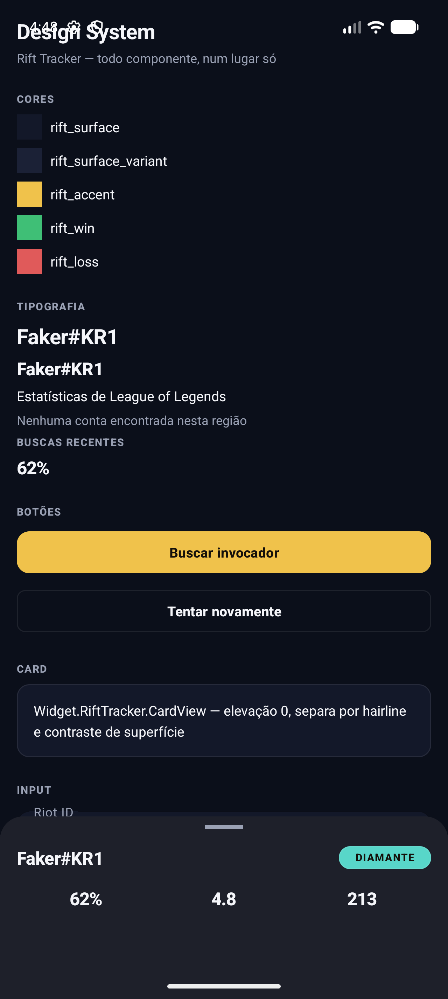
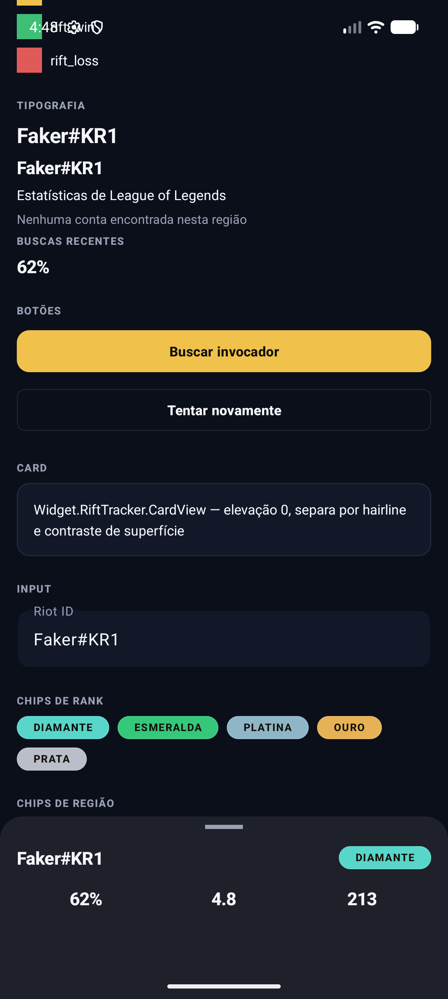
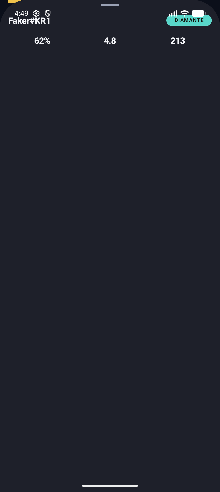

# Rift Tracker — Design System

Design system do [Rift Tracker](https://github.com/veronezzi/rift-tracker), um app Android de estudo pra acompanhar jogadores de League of Legends. Este repositório é a fonte de verdade dos tokens, componentes e da referência visual — a implementação em XML/Views vive no repo do app (`res/values/colors.xml`, `dimens.xml`, `type.xml`, `shapes.xml`, `styles.xml`, `themes.xml`), porque um recurso Android só compila dentro do módulo que o usa. Aqui fica a documentação, os exemplos de uso, os screenshots reais e o protótipo web que deu origem a tudo isso.

A origem é um mockup web (skill `apple-design`, ver `prototypes/`) — este documento traduz aquele mockup pra Android/Views. Onde a tradução não é 1:1, está anotado abaixo.



*Screenshot real do app rodando (`DesignSystemPreviewActivity`, ver seção "Vitrine" abaixo) — não é mockup.*

## Vitrine web (`test-app/`)

`test-app/index.html` é uma vitrine interativa que roda em qualquer navegador (sem Android Studio, sem emulador) — abra o arquivo direto. Cada componente é clicável: abre um painel com a versão de verdade pra você interagir (botão reage ao toque, chip seleciona, input aceita texto, bottom sheet arrasta) e o XML exato de uso, com botão de copiar.

## Vitrine Android (`DesignSystemPreviewActivity`)

Todo componente descrito aqui também está montado numa tela só, no repo do app, que só existe em build debug (`app/src/debug/`) — não faz parte do app de produção nem do `nav_graph`. É o jeito de conferir visualmente um token ou um widget rodando de verdade no Android, não só a aproximação web.

```bash
# a partir do clone de rift-tracker
./gradlew installDebug
```

Depois abra o ícone **"Rift Tracker — Design System"** no launcher do emulador/dispositivo.

## Protótipo web (`prototypes/`)

`apple-design-mockup.html` é o mockup interativo original — cartão de perfil arrastável com spring físico de verdade (Pointer Events + `requestAnimationFrame`), seguindo a skill `apple-design`. Abra o arquivo direto no navegador. É o ponto de partida de qualquer mudança visual: primeiro evolui aqui, depois traduz pra XML no repo do app.

## Por que dark-only

O app não tem modo claro. Não é uma limitação — é a identidade visual do produto (como um app de jogo). Por isso `Theme.RiftTracker` estende `Theme.Material3.Dark.NoActionBar`, não `.DayNight`, e não existe pasta `values-night/`. Se algum dia quiser suportar tema claro, isso é uma decisão de produto nova, não um bug a corrigir.

## Cores (`colors.xml`)

| Token | Uso |
|---|---|
| `rift_bg` | Fundo da tela |
| `rift_surface` | Cards, inputs, sheets |
| `rift_surface_variant` | Superfície um nível acima (ex.: avatar dentro de um card) |
| `rift_on_surface` | Texto principal |
| `rift_on_surface_muted` | Texto secundário, labels, metadado |
| `rift_hairline` | Bordas finas (branco a 8% de opacidade) |
| `rift_accent` | Cor de destaque (dourado Hextech) — CTA principal, ícone ativo |
| `rift_on_accent` | Texto/ícone em cima de `rift_accent` |
| `rift_win` / `rift_loss` | Resultado de partida |
| `rank_diamond`, `rank_emerald`, `rank_platinum`, `rank_gold`, `rank_silver` | Tiers de rank |

**Rank não tem estilo de chip com cor fixa.** `Widget.RiftTracker.Chip.Rank` define forma e tipografia, mas não `chipBackgroundColor` — quem constrói a tela de busca/perfil mapeia o tier retornado pela Riot API pro `rank_*` certo e seta a cor no código. Isso é lógica de feature, não faz parte do design system.

**Uso** — cor direto de um `View`/background:

```xml
<View
    android:layout_width="24dp"
    android:layout_height="24dp"
    android:background="@color/rift_accent" />
```

## Espaçamento e forma (`dimens.xml`, `shapes.xml`)

Espaçamento em múltiplos de 4dp (`spacing_xxs` a `spacing_xxl`). Raio de canto em uma escala fixa (`corner_xs` a `corner_xl`) — não hardcode `android:radius` ou padding solto num layout novo, use os dimens.

**Uso:**

```xml
<LinearLayout
    android:layout_width="match_parent"
    android:layout_height="wrap_content"
    android:orientation="vertical"
    android:padding="@dimen/spacing_lg">

    <TextView
        android:layout_width="wrap_content"
        android:layout_height="wrap_content"
        android:layout_marginTop="@dimen/spacing_sm"
        android:text="..." />
</LinearLayout>
```

## Tipografia (`type.xml`)

Sem fonte customizada — o mockup usa a fonte do sistema, então aqui é só Roboto (padrão do Android) variando peso/tamanho/tracking:

- `TextAppearance.RiftTracker.Title` / `.SheetTitle` — nomes, títulos de tela.
- `TextAppearance.RiftTracker.Body` / `.BodySmall` — texto corrido.
- `TextAppearance.RiftTracker.LabelUppercase` — rótulos tipo "BUSCAS RECENTES", sempre maiúsculo e curto. Nunca usar em texto longo.
- `TextAppearance.RiftTracker.StatValue` — números que precisam alinhar (KDA, winrate, contagem de partidas). Usa `fontFeatureSettings="tnum"` (algarismos tabulares) pra não "dançar" quando o dígito muda.

**Uso:**

```xml
<TextView
    android:layout_width="wrap_content"
    android:layout_height="wrap_content"
    android:text="Buscas recentes"
    android:textAppearance="@style/TextAppearance.RiftTracker.LabelUppercase" />

<TextView
    android:layout_width="wrap_content"
    android:layout_height="wrap_content"
    android:text="62%"
    android:textAppearance="@style/TextAppearance.RiftTracker.StatValue" />
```

## Componentes (`styles.xml`)

Todos em cima de Material Components — nunca implemente um botão/card/input do zero.

### Botões

`Widget.RiftTracker.Button.Primary` é o `materialButtonStyle` padrão do tema — qualquer `<Button>`/`MaterialButton` já nasce estilizado, sem precisar de `style=`. `Widget.RiftTracker.Button.Outlined` é a ação secundária (ex.: "Tentar novamente").

```xml
<com.google.android.material.button.MaterialButton
    android:layout_width="match_parent"
    android:layout_height="wrap_content"
    android:text="Buscar invocador" />

<com.google.android.material.button.MaterialButton
    android:layout_width="match_parent"
    android:layout_height="wrap_content"
    android:text="Tentar novamente"
    style="@style/Widget.RiftTracker.Button.Outlined" />
```

### Card

`Widget.RiftTracker.CardView` — linha de lista, cartão de estatística. Elevação 0 de propósito: a separação vem do hairline e do contraste de cor, não de sombra.

```xml
<com.google.android.material.card.MaterialCardView
    android:layout_width="match_parent"
    android:layout_height="wrap_content">

    <TextView
        android:layout_width="match_parent"
        android:layout_height="wrap_content"
        android:padding="@dimen/spacing_lg"
        android:text="..." />
</com.google.android.material.card.MaterialCardView>
```

### Input

`Widget.RiftTracker.TextInputLayout` — campo de busca do Riot ID, já é o `textInputStyle` padrão do tema.

```xml
<com.google.android.material.textfield.TextInputLayout
    android:layout_width="match_parent"
    android:layout_height="wrap_content"
    android:hint="Riot ID">

    <com.google.android.material.textfield.TextInputEditText
        android:layout_width="match_parent"
        android:layout_height="wrap_content" />
</com.google.android.material.textfield.TextInputLayout>
```

### Chips



`Widget.RiftTracker.Chip.Rank` — a cor vem de fora (ver seção Cores acima):

```xml
<com.google.android.material.chip.Chip
    style="@style/Widget.RiftTracker.Chip.Rank"
    android:layout_width="wrap_content"
    android:layout_height="wrap_content"
    android:text="Diamante"
    android:textColor="@color/rift_on_accent"
    app:chipBackgroundColor="@color/rank_diamond" />
```

`Widget.RiftTracker.Chip.Region` — selecionável, o estado marcado já troca de cor sozinho (`res/color/chip_region_background.xml` e `chip_region_text.xml`):

```xml
<com.google.android.material.chip.ChipGroup
    android:layout_width="match_parent"
    android:layout_height="wrap_content"
    app:singleSelection="true">

    <com.google.android.material.chip.Chip
        style="@style/Widget.RiftTracker.Chip.Region"
        android:layout_width="wrap_content"
        android:layout_height="wrap_content"
        android:checkable="true"
        android:checked="true"
        android:text="KR" />
</com.google.android.material.chip.ChipGroup>
```

### Bottom sheet

Ver a seção dedicada logo abaixo.

## O cartão arrastável (bottom sheet) → `BottomSheetBehavior`



No mockup web, o cartão de perfil arrasta com spring físico escrito à mão (velocidade do gesto decide onde encaixar, pode ser agarrado no meio do movimento). No Android, **não reescreva essa física na mão** — `com.google.android.material.bottomsheet.BottomSheetBehavior` já entrega isso de graça: fling com velocidade real, estados (`STATE_COLLAPSED`/`STATE_HALF_EXPANDED`/`STATE_EXPANDED`/`STATE_HIDDEN`), e é o que qualquer app Android nativo (inclusive apps da própria Apple... quer dizer, Google) usa pra esse padrão.

`Widget.RiftTracker.BottomSheet` já configura:
- `behavior_peekHeight` = `bottom_sheet_peek_height` (o "espiando" inicial, equivalente ao estado `peek` do mockup)
- `behavior_halfExpandedRatio` = 0.55 (equivalente ao estado `half`)
- `behavior_hideable` = true (equivalente ao estado `hidden`)
- cantos de cima arredondados (`ShapeAppearance.RiftTracker.SheetTop`)

**Uso** — o layout do sheet é um filho direto do `CoordinatorLayout`, com o resto da tela (a lista de busca, por exemplo) sendo o outro filho:

```xml
<androidx.coordinatorlayout.widget.CoordinatorLayout
    android:layout_width="match_parent"
    android:layout_height="match_parent">

    <!-- conteúdo normal da tela aqui -->

    <LinearLayout
        android:id="@+id/sheet"
        style="@style/Widget.RiftTracker.BottomSheet"
        android:layout_width="match_parent"
        android:layout_height="match_parent"
        android:orientation="vertical"
        app:layout_behavior="@string/bottom_sheet_behavior">

        <!-- conteúdo do sheet aqui -->
    </LinearLayout>
</androidx.coordinatorlayout.widget.CoordinatorLayout>
```

```kotlin
BottomSheetBehavior.from(binding.sheet).state = BottomSheetBehavior.STATE_COLLAPSED
```

O resto (arrastar, soltar, fling por velocidade) é o Android que faz — não é preciso escrever nenhum `PointerEvent`/spring manual, como no mockup web.

## O que não tem equivalente direto

O mockup usa `backdrop-filter: blur()` (vidro translúcido) no sheet e na barra superior. Isso não tem equivalente direto e barato em Views pré-API 31 (blur real de verdade exige `RenderEffect`, API 31+, e não é algo pra sustentar num app de estudo). A tradução deliberada foi: cor de superfície sólida (`rift_surface`) + elevação de camada, que é o jeito idiomático Android de comunicar hierarquia de material — não é uma versão "incompleta" do mockup, é a tradução certa pra essa plataforma.

## Licença

MIT.
